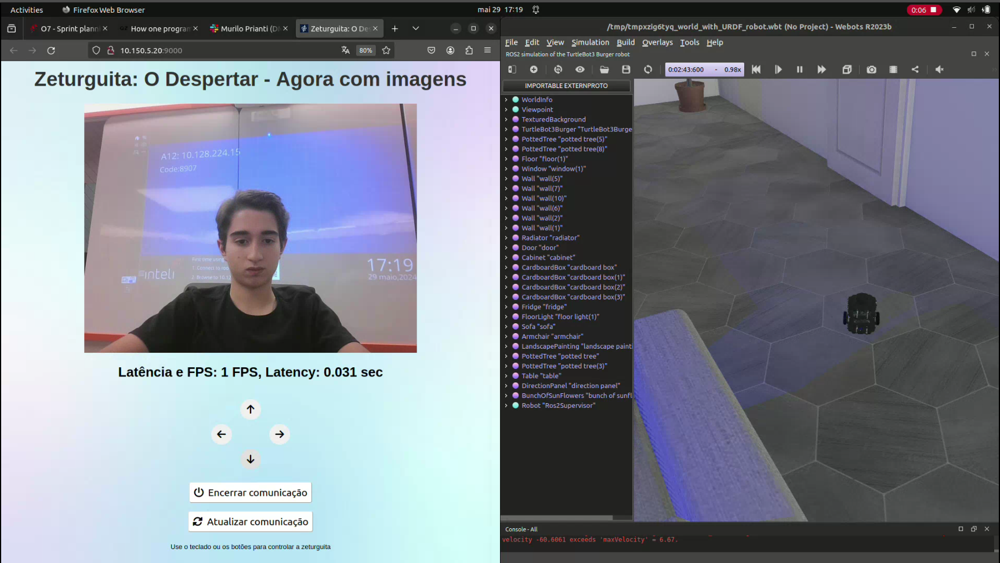

# Zeturguita: O Despertar - Agora com imagens



Este repositório é uma continuação da série Zeturguita, onde implementamos funcionalidades com ROS 2. 
* [Zeturguita: O Desenhador do ROS](https://github.com/josevalencar/ros-turtlesim)
* [Zeturguita: O Retorno](https://github.com/josevalencar/ros2-turtlebot3-moves)
* ***Zeturguita: O Despertar - Agora com imagens***

Agora, temos um programa Python com uma interface em HTML com o acesso a WebCam para controlar um TurtleBot3 usando o ROS 2 (Robot Operating System). O programa permite controlar o robô usando o teclado ou os botões dispostos na tela, ajustando a velocidade linear e angular em tempo real e podendo ver a quantidade de FPS e a latência da comunicação.

# Funcionalidades

## Webcam ao vivo
A câmera do dispositivo é exibida diretamente na interface gráfica, podendo observar a quantidade de FPS e a latência. 

## Movimentação do robô

Diferente da CLI, aqui podemos controlar o robô tanto pelas teclas de seta do teclado quanto pelos botões no HTML:

* Seta para cima: Robo vai para frente 
* Seta para baixo: Robo vai para trás 
* Seta para direita: Robo gira em torno do seu eixo para a direita 
* Seta para esquerda: Robo gira em torno do seu eixo para a esquerda

## Encerrar e atualizar comunicação

Clique em encerrar comunicação! Este botão encerrar a comunicação geral com o ROS. Isso serve como uma parada de emergência. Se clicar em atualizar comunicação, a conexão com o websocket é reestabelecida. 

# Rodando

## Instalação do WeBots (simulador do robô)

Para usar o WeBots, é necessário preparar o ambiente executando os seguintes comandos:

1. Abra o terminal e rode os comandos a seguir:

```bash
sudo apt install ros-humble-navigation2 ros-humble-nav2-bringup ros-humble-turtlebot3*

sudo apt install ros-humble-rmw-cyclonedds-cpp

echo "export RMW_IMPLEMENTATION=rmw_cyclonedds_cpp" >> ~/.bashrc
```
2. Depois de rodar esses comandos:

```bash
sudo mkdir -p /etc/apt/keyrings
cd /etc/apt/keyrings
sudo wget -q https://cyberbotics.com/Cyberbotics.asc
echo "deb [arch=amd64 signed-by=/etc/apt/keyrings/Cyberbotics.asc] https://cyberbotics.com/debian binary-amd64/" | sudo tee /etc/apt/sources.list.d/Cyberbotics.list
```

```bash
sudo apt update
sudo apt install webots
sudo apt install ros-humble-webots-ros2
```
## Rosbridge (Comunicação Websocket)
Certifique-se de ter o ROS 2 instalado no seu sistema. Além disso, é necessário preparar a área de trabalho para trabalhar com o ROS 2.

1. Instale o ROS seguindo as instruções no site oficial: [ROS Installation](http://wiki.ros.org/Installation).

2. Para poder instalar o WebSockets e o RosBridge, temos que rodar o seguinte comando:

```cmd
sudo apt install ros-humble-rosbridge-suite
```

## Venv (ambiente virtual)

Para garantir que não haja diferença das dependências da minha máquina para a sua, rode:

```bash
python3 -m venv venv # instala o venv
source venv/bin/activate # ativa o venv
pip install -r requirements.txt # instala as dependências exigidas
```

## Executando o Programa

Após preparar o ambiente, você pode executar o programa para controlar a tartaruga pela interface digital. Execute os seguintes comandos:

1. Rode o webots:

```bash
ros2 launch webots_ros2_turtlebot robot_launch.py
```

2. Rode o Websocket:

```bash
ros2 launch rosbridge_server rosbridge_websocket_launch.xml
```
3. Rode o arquivo para enviar as imagens. Caso seja no robô, este processo pode ser feito via SSH:
```bash
python3 sender.py
```

4. Por final, rode o servidor flask:
```bash
python3 app.py
```

# Demonstração


Para acessar uma demonstração, pode clicar neste [link](https://youtu.be/8PK7j5mhwRg) ou ver acima.